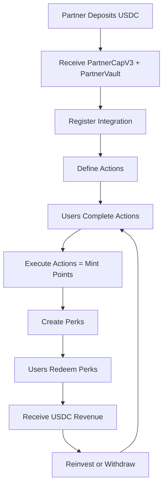

# Partner Integration Guides

Welcome to the Alpha Points Partner Ecosystem! This directory contains comprehensive guides to help partners integrate with our USDC-backed points protocol.

## 🎯 Quick Start

### **New Partners Start Here**
1. **[Onboarding Guide](./onboarding-guide.md)**: Complete setup from registration to first points minting
2. **[Integration Patterns](./integration-patterns.md)**: Common integration approaches and best practices
3. **[API Reference](../modules/api-reference.md)**: Function references for all active modules

### **By Partner Type**
- **[Gaming Partners](./gaming-integration.md)**: Level completions, achievements, tournaments
- **[E-commerce Partners](./ecommerce-integration.md)**: Purchase rewards, loyalty programs, referrals
- **[DeFi Partners](./defi-integration.md)**: Yield farming, liquidity provision, governance participation
- **[Social/Content Partners](./social-integration.md)**: Content creation, community engagement, social actions

### **Advanced Topics**
- **[Webhook Implementation](./webhook-guide.md)**: Real-time notifications and event handling
- **[Revenue Optimization](./revenue-guide.md)**: Maximizing earnings through perk strategies
- **[Security Best Practices](./security-guide.md)**: Protecting your integration and users
- **[Testing & Monitoring](./testing-guide.md)**: Quality assurance and health monitoring

---

## 🏗️ System Architecture

### **Partner Journey Overview**



### **Key Components**

1. **USDC Collateral System**: Stable backing eliminates volatility risk
2. **Action Registration**: Define which user actions mint points
3. **Quota Management**: Daily and lifetime limits prevent abuse
4. **Revenue Sharing**: Earn USDC when users redeem your perks
5. **DeFi Integration**: Vaults can be used in yield protocols

---

## 💰 Economic Model

### **Collateral Requirements**
- **Minimum Deposit**: $100 USDC to create partner vault
- **Backing Ratio**: 110% collateralization required for point minting
- **DeFi Threshold**: $1,000 minimum to integrate with DeFi protocols

### **Revenue Distribution**
When users redeem your perks with USDC payment:
```
Perk Sale (100% of USDC payment)
├── 70% → Partner (immediate payout)
├── 20% → Platform Treasury
└── 10% → Partner Vault Growth (increases your backing capacity)
```

### **Points Economics**
- **Fixed Rate**: 1 USD = 1,000 Alpha Points (never changes)
- **Minting Cost**: Points backed 1:1 by your USDC collateral
- **Daily Limits**: Configurable per action to prevent abuse
- **Supply Cap**: 1 trillion points maximum across entire protocol

---

## 🚀 Integration Approaches

### **1. Backend Integration (Recommended)**
- **Best for**: Gaming, e-commerce, DeFi platforms
- **How**: Call smart contracts from your backend when users complete actions
- **Benefits**: Full control, server-side validation, bulk operations
- **Security**: API keys, webhook secrets, rate limiting

### **2. Frontend Integration**
- **Best for**: Simple web apps, promotional campaigns
- **How**: Users directly interact with smart contracts via wallet
- **Benefits**: No backend required, immediate execution
- **Limitations**: User pays gas, potential for abuse

### **3. Hybrid Integration**
- **Best for**: Complex applications with multiple touchpoints
- **How**: Combine backend validation with frontend execution
- **Benefits**: Best of both worlds, flexible user experience
- **Complexity**: Requires coordination between frontend and backend

---

## 📊 Success Metrics

### **Partner Performance Indicators**
- **Points Minted**: Total points generated by your actions
- **Perk Redemptions**: Revenue generated from your offerings
- **User Engagement**: Unique users completing your actions
- **Revenue per User**: Average USDC earned per engaged user
- **Vault Utilization**: Percentage of collateral actively backing points

### **Optimization Strategies**
1. **Action Diversity**: Offer multiple ways for users to earn points
2. **Perk Appeal**: Create valuable redemption opportunities
3. **Pricing Strategy**: Balance points cost vs USDC revenue
4. **User Journey**: Smooth onboarding to redemption flow
5. **Community Building**: Foster repeat engagement

---

## 🔧 Technical Requirements

### **Smart Contract Integration**
- **Sui Wallet**: For transaction signing and gas payments
- **USDC Tokens**: Testnet or mainnet USDC for collateral
- **RPC Endpoint**: Sui network connection for contract calls
- **Gas Management**: SUI tokens for transaction fees

### **Backend Requirements** (if applicable)
- **API Keys**: Secure storage and rotation
- **Webhook Endpoints**: HTTPS endpoints for real-time notifications
- **Database**: User action tracking and analytics
- **Rate Limiting**: Prevent abuse and respect quotas

### **Frontend Requirements** (if applicable)
- **Wallet Integration**: Sui wallet connection (@mysten/wallet-kit)
- **Contract Interaction**: Transaction building and execution
- **User Interface**: Clear point earning and spending flows
- **Error Handling**: Graceful failure management

---

## 📚 Resources

### **Documentation**
- **[Smart Contract Source](../../sources/)**: Complete Move implementation
- **[Architecture Diagrams](../architecture/)**: System design and data flows
- **[API Reference](../modules/api-reference.md)**: Function signatures and parameters
- **[Error Codes](../modules/errors.md)**: Comprehensive error handling guide

### **Tools & SDKs**
- **[@mysten/sui](https://www.npmjs.com/package/@mysten/sui)**: Official Sui TypeScript SDK
- **[Sui Explorer](https://suiexplorer.com/)**: Transaction and object inspection
- **[Sui Wallet](https://chrome.google.com/webstore/detail/sui-wallet)**: Browser extension wallet
- **[Move Analyzer](https://marketplace.visualstudio.com/items?itemName=move.move-analyzer)**: VS Code extension for Move development

### **Support Channels**
- **GitHub Issues**: Bug reports and feature requests
- **Discord Community**: Real-time developer support
- **Partner Portal**: Dedicated support for enterprise partners
- **Documentation Updates**: Stay informed of protocol changes

---

## 🎯 Next Steps

### **For New Partners**
1. **Read**: [Onboarding Guide](./onboarding-guide.md) for complete setup instructions
2. **Choose**: Select your [integration pattern](./integration-patterns.md) based on your use case
3. **Implement**: Follow your partner type guide for specific implementation details
4. **Test**: Use our [testing guide](./testing-guide.md) to validate your integration
5. **Launch**: Deploy to production and start earning USDC revenue

### **For Existing Partners**
1. **Optimize**: Review [revenue optimization](./revenue-guide.md) strategies
2. **Expand**: Add new actions and perks to increase user engagement
3. **Integrate**: Explore [DeFi integration](./defi-integration.md) for yield opportunities
4. **Monitor**: Use our analytics to track performance and user behavior

---

**Need Help?** Check our [FAQ](./faq.md) or reach out through our support channels. We're here to help you succeed in the Alpha Points ecosystem!
