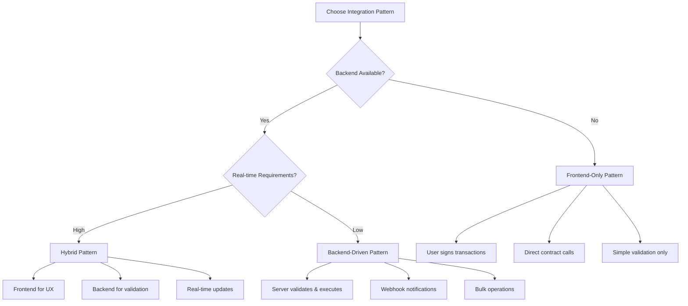

# Integration Patterns Guide

This guide covers the most effective patterns for integrating Alpha Points into your platform, with detailed implementation examples for different architectures and use cases.

## 🏗️ Architecture Overview

### **Integration Decision Tree**



---

## 🎯 Pattern 1: Backend-Driven (Recommended)

**Best for**: Gaming, e-commerce, DeFi platforms with existing backend infrastructure.

### **Architecture**

```typescript
// Your Backend Server
class AlphaPointsBackendIntegration {
  private suiClient: SuiClient;
  private partnerKeypair: Ed25519Keypair;
  private contractConfig: ContractConfig;
  
  constructor(config: BackendConfig) {
    this.suiClient = new SuiClient({ url: config.rpcUrl });
    this.partnerKeypair = Ed25519Keypair.fromSecretKey(config.privateKey);
    this.contractConfig = config.contracts;
  }
  
  // Main integration point - called when users complete actions
  async rewardUserAction(
    userId: string,
    actionType: string,
    contextData: any
  ): Promise<TransactionResult> {
    try {
      // 1. Validate the action server-side
      const isValid = await this.validateUserAction(userId, actionType, contextData);
      if (!isValid) {
        throw new Error('Invalid action');
      }
      
      // 2. Check rate limits and quotas
      await this.checkRateLimits(userId, actionType);
      
      // 3. Execute smart contract transaction
      const result = await this.executeAction(userId, actionType, contextData);
      
      // 4. Update local database
      await this.recordActionExecution(userId, actionType, result);
      
      // 5. Send notifications
      await this.notifyUser(userId, result.pointsEarned);
      
      return result;
      
    } catch (error) {
      // Log error and handle gracefully
      this.logger.error('Failed to reward user action', { userId, actionType, error });
      throw error;
    }
  }
  
  private async executeAction(
    userId: string,
    actionType: string,
    contextData: any
  ): Promise<TransactionResult> {
    const tx = new TransactionBlock();
    
    // Get action configuration
    const actionConfig = this.getActionConfig(actionType);
    
    tx.moveCall({
      target: `${this.contractConfig.packageId}::generation_manager_v2::execute_registered_action`,
      arguments: [
        tx.object(this.contractConfig.registryId),
        tx.object(this.contractConfig.integrationId),
        tx.object(actionConfig.actionId),
        tx.object(this.contractConfig.partnerCapId),
        tx.object(this.contractConfig.partnerVaultId),
        tx.object(this.contractConfig.ledgerId),
        tx.pure(userId),
        tx.pure(Array.from(Buffer.from(JSON.stringify(contextData)))),
        tx.pure('backend_server'),
        tx.object('0x6'), // Clock
      ],
    });
    
    const result = await this.suiClient.signAndExecuteTransactionBlock({
      signer: this.partnerKeypair,
      transactionBlock: tx,
      options: {
        showEffects: true,
        showObjectChanges: true,
      },
    });
    
    return {
      transactionHash: result.digest,
      pointsEarned: actionConfig.pointsPerExecution,
      success: true
    };
  }
}
```

### **API Endpoints**

```typescript
// Express.js API endpoints
app.post('/api/user-actions/level-completed', async (req, res) => {
  try {
    const { userId, levelNumber, score, completionTime } = req.body;
    
    // Validate request
    if (!userId || !levelNumber || score === undefined) {
      return res.status(400).json({ error: 'Missing required fields' });
    }
    
    // Execute action
    const result = await alphaPoints.rewardUserAction(userId, 'level_completed', {
      levelNumber,
      score,
      completionTime,
      timestamp: Date.now()
    });
    
    res.json({
      success: true,
      pointsEarned: result.pointsEarned,
      transactionHash: result.transactionHash,
      message: `Congratulations! You earned ${result.pointsEarned} Alpha Points!`
    });
    
  } catch (error) {
    res.status(500).json({ 
      error: 'Failed to process action',
      details: error.message 
    });
  }
});

app.post('/api/user-actions/purchase-made', async (req, res) => {
  try {
    const { userId, purchaseAmount, itemId } = req.body;
    
    // Calculate bonus points (e.g., 1% of purchase as points)
    const bonusPoints = Math.floor(purchaseAmount * 10); // $1 = 10 points bonus
    
    const result = await alphaPoints.rewardUserAction(userId, 'purchase_made', {
      purchaseAmount,
      itemId,
      bonusPoints,
      timestamp: Date.now()
    });
    
    res.json({
      success: true,
      pointsEarned: result.pointsEarned,
      bonusMessage: `Bonus: ${result.pointsEarned} Alpha Points for your purchase!`
    });
    
  } catch (error) {
    res.status(500).json({ error: 'Failed to process purchase bonus' });
  }
});
```

### **Webhook Handler**

```typescript
// Handle webhooks from Alpha Points protocol
app.post('/webhooks/alpha-points', express.raw({ type: 'application/json' }), (req, res) => {
  const signature = req.headers['x-alpha-signature'];
  const payload = req.body;
  
  // Verify webhook signature
  if (!verifyWebhookSignature(payload, signature, process.env.WEBHOOK_SECRET)) {
    return res.status(401).send('Unauthorized');
  }
  
  const event = JSON.parse(payload.toString());
  
  switch (event.type) {
    case 'action_executed':
      handleActionExecuted(event.data);
      break;
      
    case 'perk_redeemed':
      handlePerkRedeemed(event.data);
      break;
      
    case 'vault_low_balance':
      handleLowBalance(event.data);
      break;
      
    default:
      console.log(`Unhandled webhook event: ${event.type}`);
  }
  
  res.status(200).send('OK');
});

async function handleActionExecuted(data: ActionExecutedData) {
  // Update user's local point balance
  await updateUserPoints(data.userAddress, data.pointsEarned);
  
  // Send push notification
  await sendPushNotification(data.userAddress, {
    title: 'Points Earned!',
    body: `You earned ${data.pointsEarned} Alpha Points!`,
    data: { actionType: data.actionName }
  });
  
  // Update analytics
  await analytics.track('Points Earned', {
    userId: data.userAddress,
    points: data.pointsEarned,
    action: data.actionName,
    timestamp: data.executionTimestamp
  });
}
```

---

## 🎨 Pattern 2: Frontend-Only

**Best for**: Simple web apps, promotional campaigns, minimal backend requirements.

### **React Implementation**

```typescript
// React hook for Alpha Points integration
import { useWallet } from '@mysten/wallet-kit';
import { SuiClient } from '@mysten/sui.js/client';
import { TransactionBlock } from '@mysten/sui.js/transactions';

export function useAlphaPoints() {
  const { currentWallet, signAndExecuteTransactionBlock } = useWallet();
  const suiClient = new SuiClient({ url: getFullnodeUrl('mainnet') });
  
  const executeAction = async (
    actionType: string,
    contextData: any
  ) => {
    if (!currentWallet) {
      throw new Error('Wallet not connected');
    }
    
    const tx = new TransactionBlock();
    
    // Get action configuration from your config
    const actionConfig = getActionConfig(actionType);
    
    tx.moveCall({
      target: `${CONTRACT_CONFIG.packageId}::generation_manager_v2::execute_registered_action`,
      arguments: [
        tx.object(CONTRACT_CONFIG.registryId),
        tx.object(CONTRACT_CONFIG.integrationId),
        tx.object(actionConfig.actionId),
        tx.object(CONTRACT_CONFIG.partnerCapId),
        tx.object(CONTRACT_CONFIG.partnerVaultId),
        tx.object(CONTRACT_CONFIG.ledgerId),
        tx.pure(currentWallet.accounts[0].address),
        tx.pure(Array.from(Buffer.from(JSON.stringify(contextData)))),
        tx.pure('web_frontend'),
        tx.object('0x6'), // Clock
      ],
    });
    
    const result = await signAndExecuteTransactionBlock({
      transactionBlock: tx,
      options: {
        showEffects: true,
      },
    });
    
    return {
      transactionHash: result.digest,
      pointsEarned: actionConfig.pointsPerExecution
    };
  };
  
  const redeemPerk = async (perkId: string, usdcCoinId: string) => {
    if (!currentWallet) {
      throw new Error('Wallet not connected');
    }
    
    const tx = new TransactionBlock();
    
    tx.moveCall({
      target: `${CONTRACT_CONFIG.packageId}::perk_manager_v2::redeem_perk`,
      typeArguments: [CONTRACT_CONFIG.usdcType],
      arguments: [
        tx.object(perkId),
        tx.object(CONTRACT_CONFIG.ledgerId),
        tx.object(CONTRACT_CONFIG.partnerVaultId),
        tx.object(usdcCoinId),
        tx.pure(currentWallet.accounts[0].address),
        tx.object('0x6'), // Clock
      ],
    });
    
    const result = await signAndExecuteTransactionBlock({
      transactionBlock: tx,
      options: {
        showEffects: true,
      },
    });
    
    return result;
  };
  
  return {
    executeAction,
    redeemPerk,
    isConnected: !!currentWallet
  };
}
```

### **UI Components**

```typescript
// Action button component
export function ActionButton({ 
  actionType, 
  contextData, 
  children, 
  onSuccess 
}: ActionButtonProps) {
  const { executeAction, isConnected } = useAlphaPoints();
  const [loading, setLoading] = useState(false);
  
  const handleClick = async () => {
    if (!isConnected) {
      toast.error('Please connect your wallet first');
      return;
    }
    
    setLoading(true);
    try {
      const result = await executeAction(actionType, contextData);
      toast.success(`🎉 You earned ${result.pointsEarned} Alpha Points!`);
      onSuccess?.(result);
    } catch (error) {
      toast.error('Failed to earn points. Please try again.');
      console.error('Action execution failed:', error);
    } finally {
      setLoading(false);
    }
  };
  
  return (
    <button 
      onClick={handleClick}
      disabled={loading || !isConnected}
      className="btn btn-primary"
    >
      {loading ? (
        <>
          <Spinner className="w-4 h-4 mr-2" />
          Processing...
        </>
      ) : (
        children
      )}
    </button>
  );
}

// Usage in your app
function GameLevel() {
  const handleLevelComplete = (result: any) => {
    // Update local state, show celebration, etc.
    setPlayerPoints(prev => prev + result.pointsEarned);
    showCelebration();
  };
  
  return (
    <div>
      <h2>Level 5: Dragon's Lair</h2>
      <p>Complete this level to earn 200 Alpha Points!</p>
      
      <ActionButton
        actionType="level_completed"
        contextData={{
          levelNumber: 5,
          difficulty: 'hard',
          timestamp: Date.now()
        }}
        onSuccess={handleLevelComplete}
      >
        Complete Level & Earn Points
      </ActionButton>
    </div>
  );
}
```

### **Perk Marketplace Component**

```typescript
export function PerkMarketplace() {
  const { redeemPerk } = useAlphaPoints();
  const [perks, setPerks] = useState<Perk[]>([]);
  const [userBalance, setUserBalance] = useState(0);
  
  const handleRedeem = async (perk: Perk) => {
    try {
      // Get user's USDC coins
      const usdcCoins = await getUserUsdcCoins();
      if (usdcCoins.length === 0) {
        toast.error('You need USDC to redeem perks');
        return;
      }
      
      const result = await redeemPerk(perk.id, usdcCoins[0].coinObjectId);
      toast.success(`Successfully redeemed ${perk.name}!`);
      
      // Update local state
      setUserBalance(prev => prev - perk.pointsCost);
      
    } catch (error) {
      toast.error('Failed to redeem perk');
    }
  };
  
  return (
    <div className="grid grid-cols-1 md:grid-cols-3 gap-6">
      {perks.map(perk => (
        <PerkCard
          key={perk.id}
          perk={perk}
          userBalance={userBalance}
          onRedeem={() => handleRedeem(perk)}
        />
      ))}
    </div>
  );
}
```

---

## ⚡ Pattern 3: Hybrid (Real-time)

**Best for**: Complex applications requiring immediate user feedback with server-side validation.

### **Architecture Flow**

```typescript
// Client-side immediate feedback
class HybridAlphaPoints {
  private websocket: WebSocket;
  private pendingActions: Map<string, PendingAction> = new Map();
  
  constructor(private config: HybridConfig) {
    this.websocket = new WebSocket(config.websocketUrl);
    this.setupWebsocketHandlers();
  }
  
  // Step 1: Immediate client-side feedback
  async executeActionOptimistic(
    actionType: string,
    contextData: any
  ): Promise<OptimisticResult> {
    const actionId = generateActionId();
    
    // Show immediate UI feedback
    this.showOptimisticPoints(actionType, contextData);
    
    // Send to server for validation and execution
    const serverPromise = this.sendToServer(actionId, actionType, contextData);
    
    // Track pending action
    this.pendingActions.set(actionId, {
      actionType,
      contextData,
      timestamp: Date.now(),
      promise: serverPromise
    });
    
    // Return immediately for UI updates
    return {
      actionId,
      estimatedPoints: this.getEstimatedPoints(actionType),
      pending: true
    };
  }
  
  // Step 2: Server validation and execution
  private async sendToServer(
    actionId: string,
    actionType: string,
    contextData: any
  ) {
    try {
      const response = await fetch('/api/actions/execute', {
        method: 'POST',
        headers: { 'Content-Type': 'application/json' },
        body: JSON.stringify({
          actionId,
          actionType,
          contextData,
          userId: this.getCurrentUserId()
        })
      });
      
      const result = await response.json();
      
      if (result.success) {
        this.handleServerSuccess(actionId, result);
      } else {
        this.handleServerFailure(actionId, result.error);
      }
      
    } catch (error) {
      this.handleServerFailure(actionId, 'Network error');
    }
  }
  
  // Step 3: Handle server response
  private handleServerSuccess(actionId: string, result: any) {
    const pendingAction = this.pendingActions.get(actionId);
    if (!pendingAction) return;
    
    // Update UI with confirmed points
    this.confirmOptimisticPoints(actionId, result.pointsEarned);
    
    // Remove from pending
    this.pendingActions.delete(actionId);
    
    // Emit success event
    this.emit('actionConfirmed', { actionId, result });
  }
  
  private handleServerFailure(actionId: string, error: string) {
    const pendingAction = this.pendingActions.get(actionId);
    if (!pendingAction) return;
    
    // Revert optimistic UI changes
    this.revertOptimisticPoints(actionId);
    
    // Show error message
    this.showErrorMessage(error);
    
    // Remove from pending
    this.pendingActions.delete(actionId);
    
    // Emit failure event
    this.emit('actionFailed', { actionId, error });
  }
}
```

### **Server-Side Handler**

```typescript
// Express.js endpoint for hybrid pattern
app.post('/api/actions/execute', async (req, res) => {
  const { actionId, actionType, contextData, userId } = req.body;
  
  try {
    // Step 1: Validate the action
    const validation = await validateAction(userId, actionType, contextData);
    if (!validation.isValid) {
      return res.status(400).json({
        success: false,
        error: validation.reason,
        actionId
      });
    }
    
    // Step 2: Execute on blockchain
    const blockchainResult = await executeBlockchainAction(
      userId,
      actionType,
      contextData
    );
    
    // Step 3: Update database
    await recordActionExecution(actionId, userId, blockchainResult);
    
    // Step 4: Send real-time confirmation
    await sendWebsocketUpdate(userId, {
      type: 'action_confirmed',
      actionId,
      pointsEarned: blockchainResult.pointsEarned,
      transactionHash: blockchainResult.transactionHash
    });
    
    res.json({
      success: true,
      actionId,
      pointsEarned: blockchainResult.pointsEarned,
      transactionHash: blockchainResult.transactionHash
    });
    
  } catch (error) {
    // Send failure notification
    await sendWebsocketUpdate(userId, {
      type: 'action_failed',
      actionId,
      error: error.message
    });
    
    res.status(500).json({
      success: false,
      error: 'Execution failed',
      actionId
    });
  }
});
```

### **Real-time UI Updates**

```typescript
// React component with real-time updates
export function RealtimeActionButton({ actionType, contextData }: Props) {
  const [optimisticPoints, setOptimisticPoints] = useState(0);
  const [confirmedPoints, setConfirmedPoints] = useState(0);
  const [pendingActions, setPendingActions] = useState<string[]>([]);
  
  const { executeActionOptimistic } = useHybridAlphaPoints();
  
  const handleAction = async () => {
    // Step 1: Optimistic update
    const result = await executeActionOptimistic(actionType, contextData);
    
    setOptimisticPoints(prev => prev + result.estimatedPoints);
    setPendingActions(prev => [...prev, result.actionId]);
    
    // Step 2: Wait for confirmation (handled by websocket)
    // UI will update automatically when server confirms
  };
  
  // Listen for real-time updates
  useEffect(() => {
    const handleActionConfirmed = (event: ActionConfirmedEvent) => {
      // Move points from optimistic to confirmed
      setOptimisticPoints(prev => prev - event.estimatedPoints);
      setConfirmedPoints(prev => prev + event.actualPoints);
      setPendingActions(prev => prev.filter(id => id !== event.actionId));
    };
    
    const handleActionFailed = (event: ActionFailedEvent) => {
      // Revert optimistic points
      setOptimisticPoints(prev => prev - event.estimatedPoints);
      setPendingActions(prev => prev.filter(id => id !== event.actionId));
      toast.error(`Action failed: ${event.error}`);
    };
    
    alphaPoints.on('actionConfirmed', handleActionConfirmed);
    alphaPoints.on('actionFailed', handleActionFailed);
    
    return () => {
      alphaPoints.off('actionConfirmed', handleActionConfirmed);
      alphaPoints.off('actionFailed', handleActionFailed);
    };
  }, []);
  
  return (
    <div>
      <button onClick={handleAction} disabled={pendingActions.length > 0}>
        Earn Points
      </button>
      
      <div className="points-display">
        <span className="confirmed">{confirmedPoints} confirmed</span>
        {optimisticPoints > 0 && (
          <span className="pending">+{optimisticPoints} pending</span>
        )}
      </div>
      
      {pendingActions.length > 0 && (
        <div className="pending-indicator">
          <Spinner /> {pendingActions.length} action(s) pending...
        </div>
      )}
    </div>
  );
}
```

---

## 🔄 Pattern 4: Batch Processing

**Best for**: High-volume applications, analytics platforms, bulk reward distributions.

### **Batch Execution**

```typescript
class BatchAlphaPoints {
  private batchQueue: BatchAction[] = [];
  private batchSize = 50;
  private batchInterval = 30000; // 30 seconds
  
  constructor() {
    // Process batches periodically
    setInterval(() => this.processBatch(), this.batchInterval);
  }
  
  // Add action to batch queue
  queueAction(userId: string, actionType: string, contextData: any): string {
    const actionId = generateActionId();
    
    this.batchQueue.push({
      actionId,
      userId,
      actionType,
      contextData,
      timestamp: Date.now()
    });
    
    // Process immediately if batch is full
    if (this.batchQueue.length >= this.batchSize) {
      this.processBatch();
    }
    
    return actionId;
  }
  
  // Process batch of actions
  private async processBatch() {
    if (this.batchQueue.length === 0) return;
    
    const batch = this.batchQueue.splice(0, this.batchSize);
    
    try {
      // Group by action type for efficiency
      const groupedActions = this.groupByActionType(batch);
      
      // Execute each group
      for (const [actionType, actions] of Object.entries(groupedActions)) {
        await this.executeBatchGroup(actionType, actions);
      }
      
    } catch (error) {
      console.error('Batch processing failed:', error);
      
      // Re-queue failed actions
      this.batchQueue.unshift(...batch);
    }
  }
  
  private async executeBatchGroup(actionType: string, actions: BatchAction[]) {
    const tx = new TransactionBlock();
    
    // Add multiple action executions to single transaction
    for (const action of actions) {
      tx.moveCall({
        target: `${PACKAGE_ID}::generation_manager_v2::execute_registered_action`,
        arguments: [
          tx.object(REGISTRY_ID),
          tx.object(INTEGRATION_ID),
          tx.object(this.getActionId(actionType)),
          tx.object(PARTNER_CAP_ID),
          tx.object(PARTNER_VAULT_ID),
          tx.object(LEDGER_ID),
          tx.pure(action.userId),
          tx.pure(Array.from(Buffer.from(JSON.stringify(action.contextData)))),
          tx.pure('batch_processor'),
          tx.object('0x6'), // Clock
        ],
      });
    }
    
    // Execute batch transaction
    const result = await this.suiClient.signAndExecuteTransactionBlock({
      signer: this.partnerKeypair,
      transactionBlock: tx,
    });
    
    // Notify all users in batch
    await this.notifyBatchUsers(actions, result);
  }
}
```

### **Analytics Integration**

```typescript
// Batch analytics processing
class AnalyticsBatchProcessor {
  async processDailyRewards(date: Date) {
    const analytics = await this.getDailyAnalytics(date);
    const batchActions: BatchAction[] = [];
    
    // Process user engagement rewards
    for (const user of analytics.activeUsers) {
      if (user.engagementScore > 80) {
        batchActions.push({
          actionId: generateActionId(),
          userId: user.address,
          actionType: 'high_engagement_bonus',
          contextData: {
            engagementScore: user.engagementScore,
            activeDays: user.activeDays,
            date: date.toISOString()
          },
          timestamp: Date.now()
        });
      }
    }
    
    // Process referral rewards
    for (const referrer of analytics.referrers) {
      batchActions.push({
        actionId: generateActionId(),
        userId: referrer.address,
        actionType: 'referral_bonus',
        contextData: {
          referralsCount: referrer.newReferrals,
          totalReferrals: referrer.totalReferrals,
          date: date.toISOString()
        },
        timestamp: Date.now()
      });
    }
    
    // Execute batch
    return await this.batchProcessor.executeBatch(batchActions);
  }
}
```

---

## 🔧 Pattern Selection Guide

### **Decision Matrix**

| Factor | Frontend-Only | Backend-Driven | Hybrid | Batch |
|--------|---------------|----------------|--------|-------|
| **Security** | Low | High | High | High |
| **Real-time UX** | Medium | Low | High | Low |
| **Scalability** | Low | Medium | Medium | High |
| **Development Complexity** | Low | Medium | High | Medium |
| **Anti-cheat Protection** | None | High | High | High |
| **User Experience** | Medium | Medium | High | Low |
| **Gas Efficiency** | Low | Medium | Medium | High |

### **Recommended Use Cases**

#### **Frontend-Only**
- ✅ Promotional campaigns
- ✅ Simple web apps
- ✅ Proof of concepts
- ❌ High-value rewards
- ❌ Anti-cheat requirements

#### **Backend-Driven**
- ✅ Gaming platforms
- ✅ E-commerce sites
- ✅ DeFi protocols
- ✅ Enterprise applications
- ❌ Real-time requirements

#### **Hybrid**
- ✅ Social platforms
- ✅ Interactive games
- ✅ Live events
- ✅ User engagement apps
- ❌ Simple applications

#### **Batch Processing**
- ✅ Analytics platforms
- ✅ Loyalty programs
- ✅ Mass distributions
- ✅ Scheduled rewards
- ❌ Interactive applications

---

## 🚀 Implementation Checklist

### **Planning Phase**
- [ ] Identify your primary use case
- [ ] Evaluate security requirements
- [ ] Assess real-time needs
- [ ] Consider development resources
- [ ] Plan for scalability

### **Development Phase**
- [ ] Set up development environment
- [ ] Implement chosen pattern
- [ ] Add error handling and logging
- [ ] Integrate analytics tracking
- [ ] Test with small user group

### **Production Phase**
- [ ] Deploy with monitoring
- [ ] Set up alerting systems
- [ ] Monitor performance metrics
- [ ] Gather user feedback
- [ ] Iterate and optimize

---

## 📞 Support & Resources

### **Pattern-Specific Support**
- **Frontend-Only**: React examples, wallet integration guides
- **Backend-Driven**: Server setup, webhook implementation
- **Hybrid**: WebSocket configuration, real-time updates
- **Batch Processing**: Queue management, performance optimization

### **Community Resources**
- **Discord**: #integration-patterns channel
- **GitHub**: Example repositories for each pattern
- **Documentation**: Detailed API references
- **Office Hours**: Weekly calls with integration experts

Choose the pattern that best fits your needs and start building! 🚀
